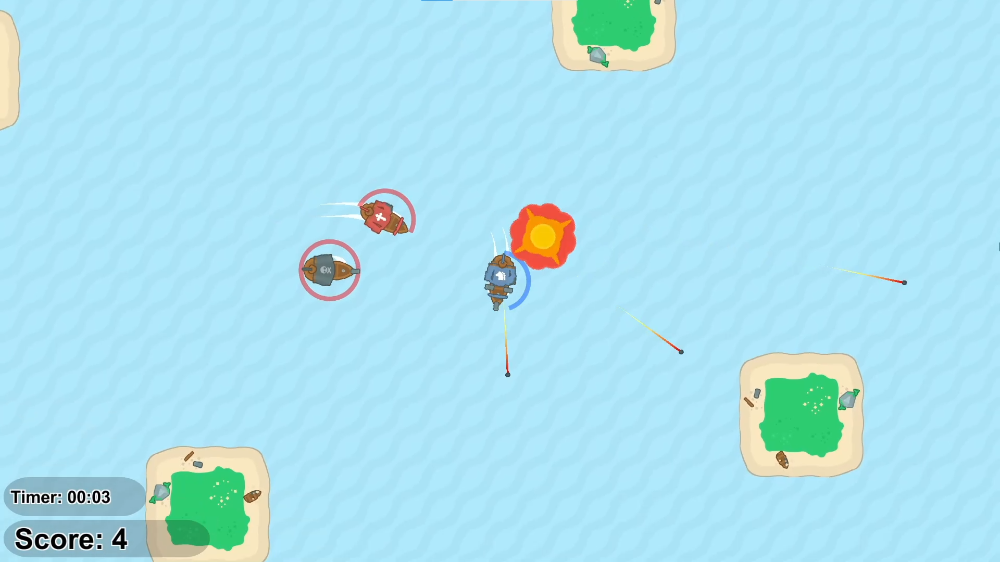

# PirateShipBattle2D

## ❔About
In a control of a pirate ship, do you need to protect yourself from the other pirate ships that are hunting you! Score points the max that you can in this 2D top down shooter by destroying the ships before the clock time ends or before they destroy you. Project realized during between 21/01/2021 and 24/01/2021.

Unity Version: 2020.3.26f1

## 📸Project Preview

[📺 Gameplay video](https://alexandre-monzen.itch.io/pirate-battle-ship-2d)

## 🧠 My experience
It was a good project to practice and consolidate my general code structure and programming logic knowledge. Finded a good way to apply inheritance and organize the methods and attributes from the classes.

[🔗 Click here to play on the browser or download the build!](https://alexandre-monzen.itch.io/pirate-battle-ship-2d)

## 🎮 How To Play
- W: Move forward
- A and S: Rotate the ship
- K: Single forward shot
- L: Double side shot

## 👩‍💻 Technologies
- C#
- Unity

## 📞 Contact
- https://linktr.ee/alexandremonzen
- https://www.linkedin.com/in/alexandremonzen
- alexandremonzen@gmail.com

## 🤚 Notes
- All third party assets that are visual, sprites, 2D and sounds were not created by me, using them for comercial use without the original creator consent or licenses are not allowed.
- This project is for study purposes only, not one single file is allowed to be used for commercial purposes.
- There is no commit, branches, or pull requests history due to being an "old" recovered project being uploaded only for portfolio reasons.
